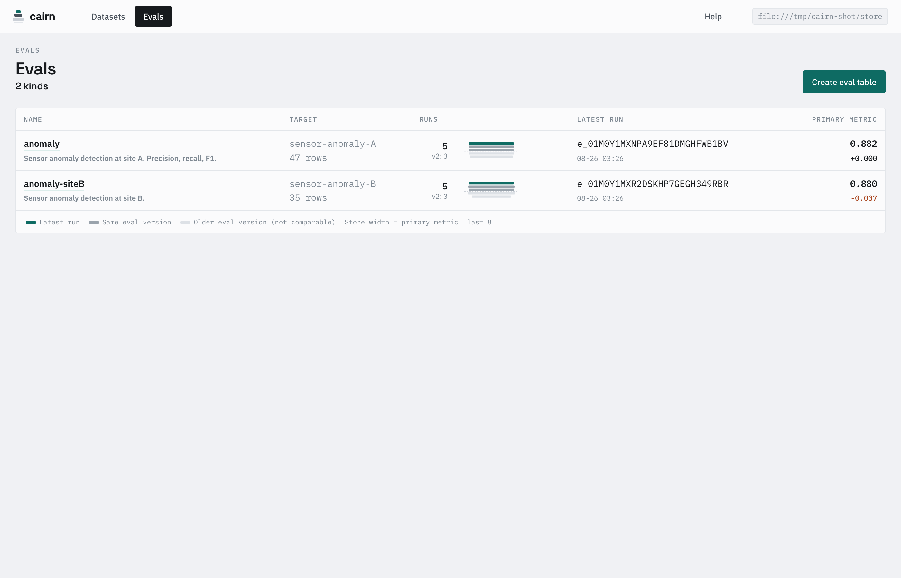
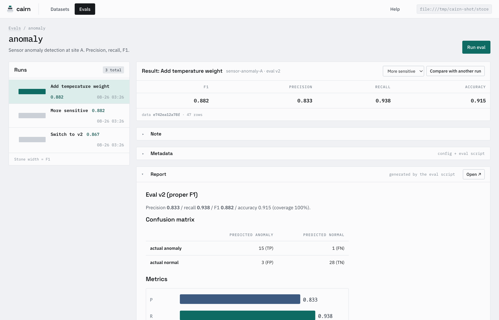
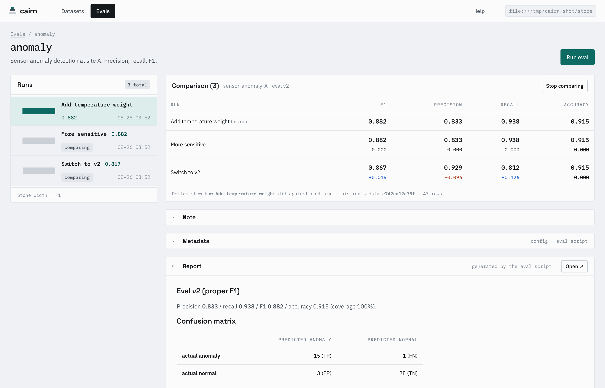
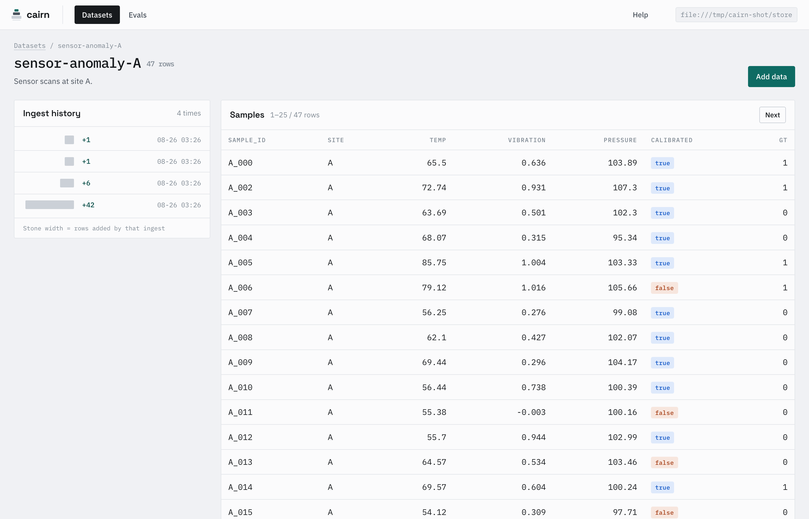
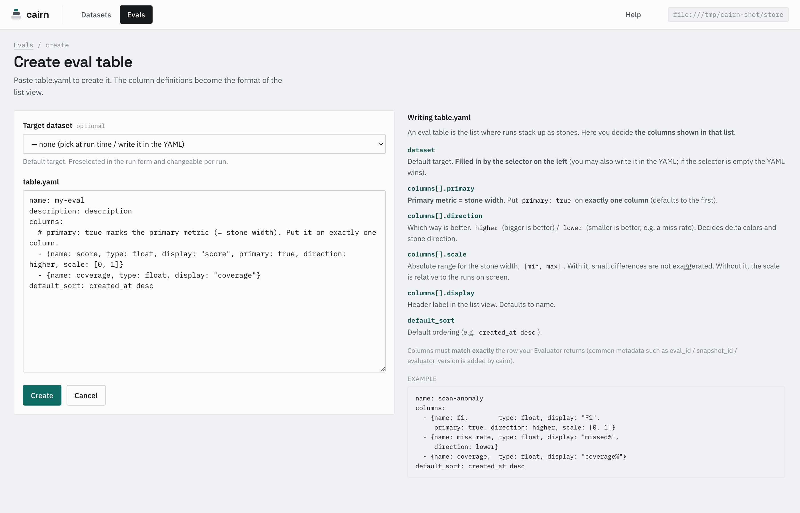
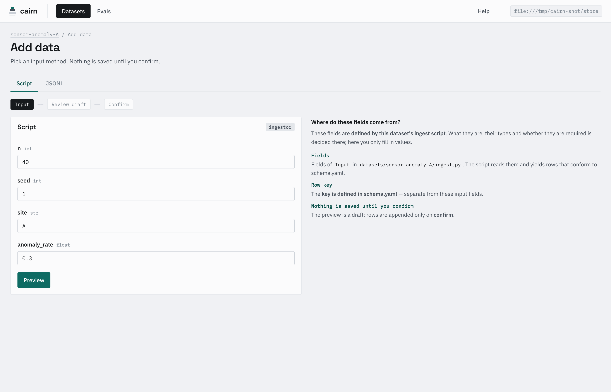
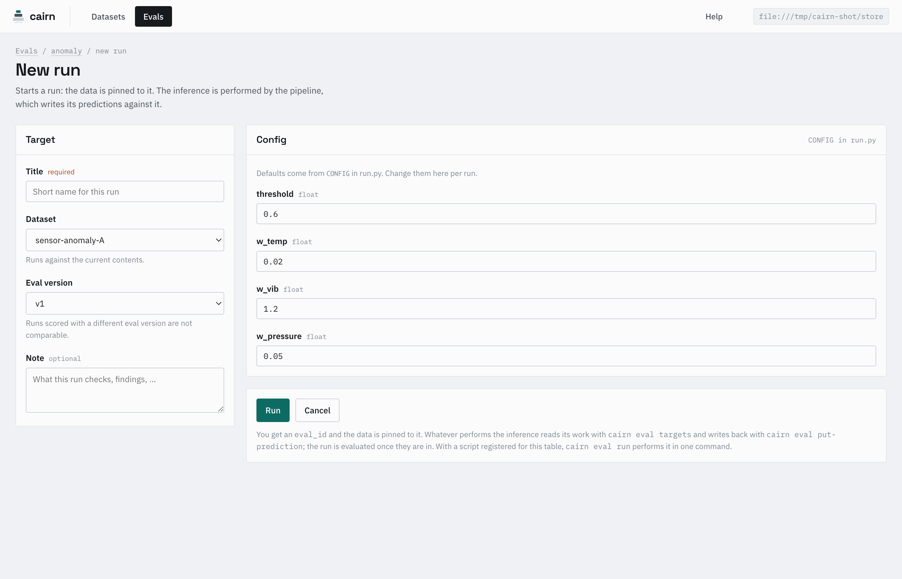
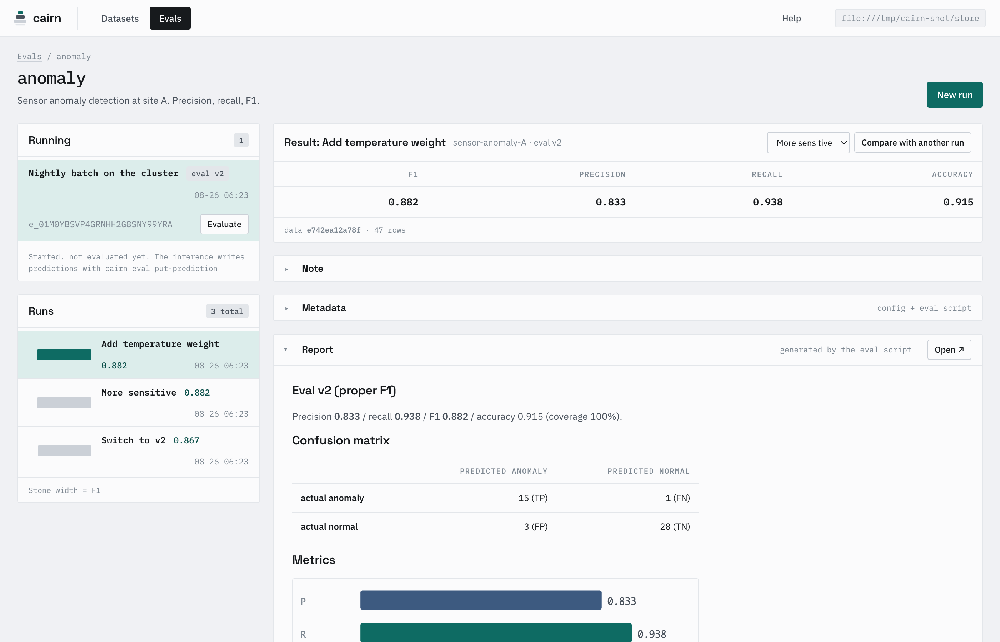
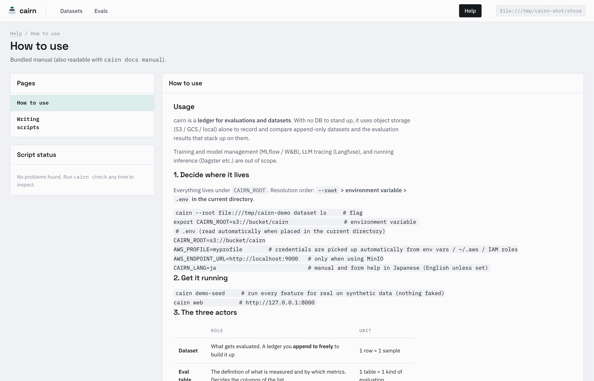

# cairn

[English](README.md) | [日本語](README.ja.md)

> **cairn** — a stack of stones that marks a trail. Each append adds a stone, the record stays immutable, and it becomes a trail marker for whoever comes next.

A **DB-free, modality-agnostic, orchestrator-agnostic** evaluation / dataset registry.
It appends, records, and compares the **datasets and evaluation results of heterogeneous inference
pipelines — LLM, object detection, segmentation, SfM, tabular — using object storage alone**.

- The single source of truth is **object storage** (S3 / GCS / local). No DB server to run.
- The platform fixes only the schema, the naming, and immutability. **Ingest and evaluation logic are the script's business.**
- **Lock-free**: writes always go to a new key, and evaluation freezes the key set with a snapshot. Neither CAS nor leases are needed (see below).
- With `file://` it runs locally with **no MinIO and no orchestrator**.

> Training and the model registry (→ MLflow/W&B), LLM tracing (→ Langfuse), and running inference
> (→ Dagster and friends) are out of scope. cairn sticks to being a **ledger for evaluations and datasets**.

## Installation

Not on PyPI yet (the name is taken by an unrelated project), so install from the repository:

```bash
pip install git+https://github.com/hosaka2/cairn      # everything except GCS
```

Requires Python 3.10 or newer. For GCS:
`pip install "cairn[gcs] @ git+https://github.com/hosaka2/cairn"`.

Working on cairn itself:

```bash
uv sync --extra dev     # test, lint and type-check tools
uv run pytest           # coverage is part of the run and must stay at 100%
uv run ruff check src tests
uv run pyright          # src and tests
```

Coverage is measured with branches and the run fails below 100%: a line that is hard to
reach is a line worth simplifying. `pyright` runs in standard mode over both `src` and `tests`.

## Configuration (`CAIRN_ROOT`)

Resolution order is **`--root` > environment variable > `.env` in the current directory**. Use whichever suits you:

```bash
cairn --root file:///tmp/cairn-demo dataset ls   # flag
export CAIRN_ROOT=s3://bucket/cairn               # environment variable
```
```env
# .env (loaded automatically when placed in the current directory)
CAIRN_ROOT=s3://bucket/cairn
AWS_PROFILE=myprofile        # or AWS_ACCESS_KEY_ID / SECRET, AWS_ENDPOINT_URL(MinIO)
CAIRN_LANG=ja                # manual and form help in Japanese; English unless set
```

> S3/GCS authentication goes through fsspec (s3fs/gcsfs = boto3's credential chain):
> environment variables, `~/.aws`, and IAM roles are picked up automatically. DuckDB reads use the same chain (credential_chain).

## Try it in a minute (`file://`, no external services)

```bash
export CAIRN_ROOT=file:///tmp/cairn-demo    # or write it in .env / pass it with --root
cairn demo-seed            # actually exercises every feature on synthetic data (see below)
cairn web                  # open http://127.0.0.1:8000
```

**Evaluation runs stack up like stones** (width = primary metric), while datasets fill out through **casual appends**.

## Screens



The eval list. Each kind is rendered with the columns from its `table.yaml`, and **runs stack up to the right as stones**
(stone width = primary metric; colour = latest run / same eval version / an older one, which is not comparable).
Under the run count, `v2: 3` names the version the latest run was scored with and how many share it.

> **State the primary metric (stone width) explicitly in `table.yaml`**: `primary: true` on a column (exactly one; the first column when omitted).
> `direction: higher|lower` sets which way is good (pixel error is lower), and `scale: [min, max]` gives an absolute range
> (with it, small differences are not exaggerated by the min/max currently on screen).



One run. The row on top, then the note, the metadata (config + which eval script scored it), and the
**report the evaluator produced**. The report is Markdown, so tables, images and SVG are up to the script;
`Open ↗` opens it full width.



`Compare with another run` lines other runs up under the one you are looking at. Deltas read
**"how this run did against that row"** and are coloured by the column's `direction`.
Runs scored with a different `evaluator_version` are not offered at all; a run scored on **other data** is offered and
then marked as such, since a delta across two snapshots does not answer the same question.



A dataset. Ingest history on the left (stone width = rows that ingest added), rows on the right,
rendered from `schema.yaml` (`bool` becomes a tag, and so on).

The UI closes the loop: **create a dataset** (schema.yaml) → **add data** (Ingestor form / JSONL, preview → confirm)
→ **create an eval table** (table.yaml) → **issue a run** → (the inference writes its predictions) → **Evaluate** → results stack up as stones.



Every YAML form has the help for that YAML next to it, plus an example generated from what is already there.



Adding data has two ways in: the **form generated from the ingest script's `Input`**, and pasted JSONL.
Both go input → preview → confirm, and nothing is written until you confirm.



Issuing a run: pick the dataset and the eval version, and edit the `CONFIG` from `run.py` for this run.
The config is stored with the run, which is where the identity of the model lives — the weights version and
its parameters. Pressing **Run** creates the run and pins the data to it; nothing is inferred here.



A started run sits under **Running** with the `eval_id` its job needs. Whatever runs the inference
reads `cairn eval targets` and writes back with `cairn eval put-prediction`; **Evaluate** appears once
an evaluator for that version is registered. Progress belongs to the orchestrator — the ledger only
knows the run started and has no result yet. The data was pinned when the run started, so
appending to the dataset meanwhile does not move the target.



The bundled manual is served at `/help`, next to anything in your scripts that fails the contract (the same thing `cairn check` reports).

> **cairn never performs the inference.** It issues the run, holds what comes back, and scores it. Running the
> demo scripts in this process is a command of its own (`cairn eval run`), which is also how you try a script out
> on a small dataset. Submitting to an orchestrator directly (the `OrchestratorAdapter` protocol) is not wired up yet.

### What `demo-seed` really puts through (nothing faked)

The bundled [`cairn/demo/`](src/cairn/demo/) is a synthetic sensor anomaly-detection pipeline that **really runs all four interfaces**:

- **Ingestor** (`ingest.py`): generates deterministic synthetic data from a seed → appends. It also demonstrates **upsert corrections and tombstone deletions**.
- **Runner** (`model.py`): bundles samples into chunks and plans a `RunSpec`.
- **OrchestratorAdapter** (InlineAdapter): runs `process_one` on the spot and **writes predictions**.
- **Evaluator** (`evaluate.py`): aggregates predictions + GT and **computes F1/precision/recall at evaluation time** (= handles metrics that do not decompose per sample correctly), plus a confusion-matrix report and SVG.
- **evaluator_version v1/v2**: the same predictions are computed differently (v1 is a coarse version where F1 ≈ accuracy, v2 is proper F1) → demonstrates that **comparison across evaluation methods is meaningless**.

The metrics really do change with the config (threshold), and that shows up in the stone width and delta in the UI.

## Driving it from the CLI (append → issue a run → evaluate)

```bash
export CAIRN_ROOT=file:///tmp/cairn-demo

# Dataset: create a schema and append JSONL (no versions to think about, append only)
cat > /tmp/s.yaml <<'YAML'
name: demo
key: id
columns:
  - {name: id, type: str, required: true}
  - {name: label, type: int, required: true}
YAML
cairn dataset create --schema /tmp/s.yaml
printf '{"id":"a","label":1}\n{"id":"b","label":0}\n' > /tmp/r.jsonl
cairn dataset ingest demo --jsonl /tmp/r.jsonl
cairn dataset show demo

# Eval: issue a run (snapshot frozen) -> write predictions and evaluate (prediction and evaluation are separate)
cairn eval create-table --table table.yaml
cairn eval create-run <table> --dataset demo --evaluator-version v1 \
    --title "first run" --config '{"threshold": 0.5}'
cairn eval score <table> <eval_id> --evaluator my.module:MyEvaluator

# Inference elsewhere (an orchestrator): the run is created here, the predictions come back here
cairn eval targets <table> <eval_id>                       # sample ids, one per line
cairn eval put-prediction <table> <eval_id> --jsonl preds.jsonl

cairn eval withdraw <table> <eval_id> --reason "wrong weights"   # out of the listings, still on record
cairn eval ls
cairn vacuum                      # collect old checkpoints (safe)
```

> To try it with a full set of convention scripts: `cairn demo-init` (wires the demo into `datasets/` and `evals/`) → `cairn demo-seed`.

For an end-to-end example driven from Python, see [`tests/test_smoke.py`](tests/test_smoke.py).

## Manuals

They ship with the package, so you can read them wherever it is installed:

```bash
cairn docs manual      # how to use it (operations, CLI, when results are comparable)
cairn docs scripting   # writing scripts (contract and reference)
cairn check            # check that the scripts you wrote follow the contract
```

From the web UI, **Help** at the top right (`/help`). The source lives in [`src/cairn/docs/`](src/cairn/docs/).

## Script conventions (nothing to guess, generated by command)

What "the platform" fixes is **where things go and what they export**. The contents are yours. At startup cairn scans the following and registers them automatically
(`CAIRN_SCRIPTS`, default = current directory):

```
datasets/<name>/
  schema.yaml            column definitions (the shape of the columns in the list view)
  ingest.py              INGESTOR = <Ingestor>        ingest. UI form generated from Input
evals/<name>/
  table.yaml             column definitions for the eval list
  run.py                 RUNNER / PROCESS_FACTORY / CONFIG   unit of inference (the same process_one as production)
  v1.py, v2.py, …        EVALUATOR = <Evaluator>      evaluator. Do not edit after merge (cut a version)
```

Generation commands (they emit templates that follow the conventions):

```bash
cairn init                       # create datasets/ and evals/
cairn new dataset my-images --kind detection
cairn new eval my-detect         # generates through v1.py
cairn new eval-version my-detect v2   # a new version of the evaluation method (the old one is left alone)
cairn demo-init                  # wire the demo in as convention files (a working example to learn from)
```

Scaffolding writes files; registering them creates the dataset and table in storage:

```bash
cairn dataset create --schema datasets/my-images/schema.yaml
cairn eval create-table --table evals/my-detect/table.yaml
cairn check                      # verify the scripts satisfy the contract
```

## Structure

```
src/cairn/
  core/        the part the platform fixes (storage/schema/dataset/evals/records/config)
  interfaces/  Ingestor / Runner / Evaluator (these three are what is fixed)
  adapters/    OrchestratorAdapter (local runs work in process)
  cli/         typer (CLI and web go through the same core)
  web/         read-only + write flows (FastAPI + Jinja2, light)
  registry.py  discover convention directories (scans datasets/ and evals/ and registers them)
  scaffold.py  templates for cairn init / new …
  demo/        synthetic demo that runs every interface (what demo-init wires up)
```

The storage layout follows "dataset = casual appends" and "**eval = stones stacked from runs**".

## Concepts

- **Results are stamped on two axes**: `(snapshot_id, evaluator_version)`. Only runs whose `snapshot_id` matches are
  comparable (identity of the data content is known automatically). Always stamping `evaluator_version` is what lets you tell whether "0.81 last month /
  0.79 this month" is a change in the content or a change in the formula. The model itself (version, parameters) goes
  **into `config`, stored together with the run** (plus `code_commit`). There is no dedicated model label.
- **Prediction and evaluation are separate**: each run writes only predictions, and **metrics that do not decompose per sample, such as mAP or AUC, are aggregated at evaluation time**.
- **The platform and the scripts are separate**: the platform fixes layout, naming, immutability, and common metadata; the ingest/evaluation logic is free.
- **How GT is held**: structured children such as a time series are **inlined into the row** with `nested` in schema.yaml (not shown in the list;
  fetched with `ctx.dataset.frames(id)`). Heavy assets such as raw waveforms, images, masks, and point clouds do not go into the ledger — **a scalar column
  holds a URL/path and evaluation reads it with `ctx.read_bytes(url)`** (= anything derivable from the columns is not held in the dataset).

### Lock-free (dropping mutual exclusion with S3 alone)

No CAS, no leases, no DynamoDB. Four rules make conflicts impossible in principle:

1. **Writes always go to a new key** (`rows/{ulid}.json`, etc.). Nothing is overwritten → no write-write conflict.
2. **A snapshot freezes the key set as of execution time**. It LISTs at run creation, and since every file is immutable that set
   points at the same content forever (clock skew and late arrivals are irrelevant). `snapshot_id` is **a hash of the merged logical content**
   (not the raw file set): re-ingesting the same rows leaves `snapshot_id` unchanged (a re-ingest after freezing does not
   break comparability), while an upsert of a value or a deletion changes it. If the content is the same, the runs are comparable.
3. **Derived artifacts are named after their input** (`manifest/{ulid}.parquet` + `covered`). Nothing is overwritten, so compaction never conflicts.
   A reader scans "covered of the latest checkpoint ∪ (LIST − covered)" (not even an assumption about ordering is needed).
4. **A listing is strictly a cache**. `_index` is not the truth: a LIST names the runs and each result is read from its own
   `runs/{eval_id}/result/row.json`. A dataset's rows go through a parquet checkpoint, which is derived and can be rebuilt.

Two things are outside these rules, deliberately. **A prediction is written under its sample's key**, so writing one
twice for the same sample keeps the last — one task owns a sample, and a retry should not leave two answers. And **a result
is written once** (scoring an evaluated run is refused), but the check is not atomic: two people scoring the same run at the
same moment both write, and since the evaluator and the predictions are the same, so is what they write.

The cost lands not on locking but on **garbage collection** → `cairn vacuum` (deletes old checkpoints; the `rows/`
referenced by a snapshot is pinned and does not disappear).

## License

MIT. See [LICENSE](LICENSE).
